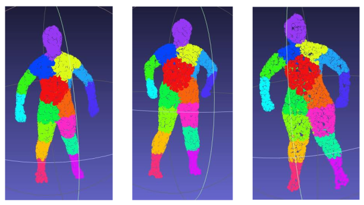
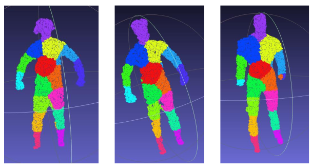

# Human Body Point Cloud Segmentation

This repository is a fine-tuned version of [Unsupervised Learning for Cuboid Shape Abstraction via Joint Segmentation from Point Clouds](https://github.com/SilenKZYoung/CuboidAbstractionViaSeg.git), designed to segment 3D human body point clouds into meaningful parts using a deep learning–based approach. The project focuses on cuboid abstraction via segmentation, enabling structured understanding of human body geometry from raw point cloud data.

## Key Features

Fine-tuned model for human body point cloud segmentation

Modular and clean code structure

Custom data loader, loss functions, and training/validation pipelines

Sample data provided for quick testing

Easy-to-extend architecture for research and experimentation

## Repository Structure
```bash
├── dataloader.py    # Dataset loading and preprocessing
├── loss.py          # Custom loss functions for segmentation
├── model.py         # Network architecture definition
├── train.py         # Training pipeline
├── val.py           # Validation and evaluation script
├── utils.py         # Utility functions (metrics, helpers, etc.)
├── samples/         # Sample point cloud data
├── README.md        # Project documentation
```

## Model Overview

The model is designed to process 3D point cloud inputs representing the human body and predict per-point segmentation labels.
It can be used as a foundation for:

 Cuboid abstraction of human bodies

 3D human pose or shape analysis

 Robotics and embodied AI perception

 3D scene understanding and animation pipelines

## Getting Started
### 1. Clone the Repository
   
```bash
git clone https://github.com/SilenKZYoung/CuboidAbstractionViaSeg.git
cd CuboidAbstractionViaSeg
```

### 2. Environment Setup

Install the required dependencies:

Python 3.8.8.

CUDA 10.2.

PyTorch 1.5.1.

TensorboardX for visualization of the training process.

### 3. Dataset Preparation

Place your point cloud data in the expected format.

You can refer to the samples/ directory for example input structure.

Dataset loading and preprocessing logic can be found in dataloader.py.

### 4. Weights
Download weights at: [weghts.pth](https://drive.google.com/file/d/18NoJFfL950TFZYxE8_JcAd9mlKSwI1o_/view?usp=sharing)

## Training

To train the segmentation model:

```bash
python train.py
```

Training configurations (batch size, learning rate, epochs, etc.) can be adjusted inside train.py or utils.py.

## Validation

To evaluate the model on the validation set:

```bash
python val.py
```

This script reports segmentation performance metrics such as accuracy and loss.

## Customization

You can easily extend this project by:

Modifying the network architecture in model.py

Adding new datasets in dataloader.py

Implementing new evaluation metrics in utils.py




